# ESC — Data Analytics
### Hackathon Analytics Dashboard

---

## 01 · PROBLEM → SOLUTION

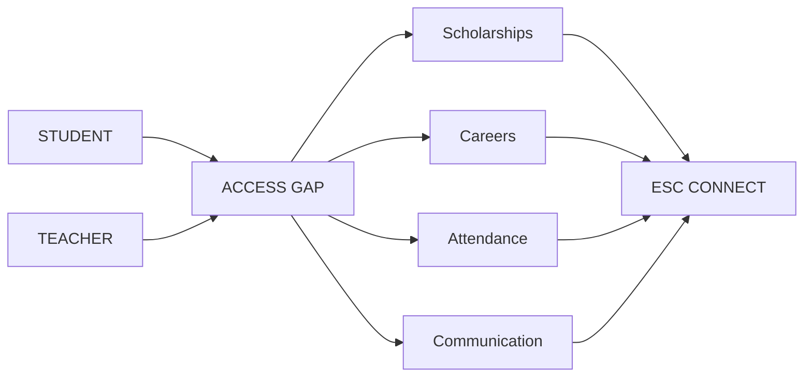

| Gap | Signal | ESC Connect |
|---|---|---|
| Scholarships | Missed deadline | Match + reminder |
| Careers | Low awareness | Jobs + ITI + internships |
| Attendance | Repeated absence | Follow-up |
| Communication | Scattered | Community |

---

## 02 · PRODUCT ARCHITECTURE

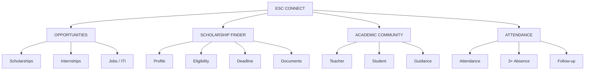

---

## 03 · USER JOURNEY

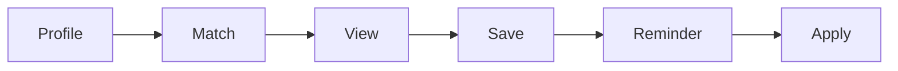

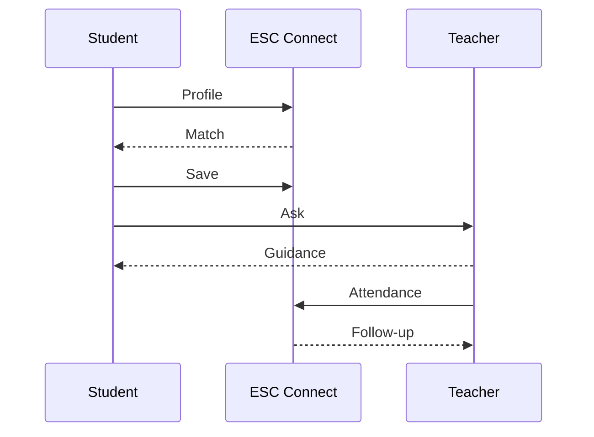

---

## 04 · ATTENDANCE SIGNAL

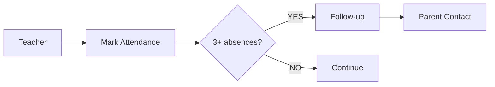

| Input | Rule | Output |
|---|---|---|
| Attendance | 3+ consecutive | Follow-up |
| Teacher action | Review | Contact |
| Goal | Early signal | Reduce dropout risk |

---

# 05 · ESC CORE — 12 AGENTS

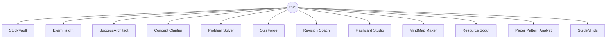

| Agent | Role |
|---|---|
| StudyVault | Sources |
| ExamInsight | Assessment |
| SuccessArchitect | Planning |
| Concept Clarifier | Learning |
| Problem Solver | Problems |
| QuizForge | Practice |
| Revision Coach | Revision |
| Flashcard Studio | Recall |
| MindMap Maker | Synthesis |
| Resource Scout | Resources |
| Paper Pattern Analyst | Exam patterns |
| GuideMinds | Actions |

---

# 06 · CAPABILITY MATRIX

| Capability | ChatGPT | Gemini | Gemini Notebook | Perplexity | **ESC** |
|---|:---:|:---:|:---:|:---:|:---:|
| AI chat | ✓ | ✓ | ✓ | ✓ | ✓ |
| Files | ✓ | ✓ | ✓ | ✓ | ✓ |
| Learning | ✓ | ✓ | ✓ | △ | ✓ |
| Research | ✓ | ✓ | ✓ | ✓ | ✓ |
| Citations | ✓ | ✓ | ✓ | ✓ | ✓ |
| Quiz / practice | ✓ | ✓ | ✓ | △ | ✓ |
| Revision | ✓ | ✓ | ✓ | △ | ✓ |
| Planning | ✓ | ✓ | △ | △ | ✓ |
| Specialist agents | △ | △ | △ | △ | **12** |
| Scholarships | — | — | — | — | **✓** |
| Jobs / ITI | — | — | — | — | **✓** |
| Teacher communication | — | — | — | — | **✓** |
| Attendance follow-up | — | — | — | — | **✓** |
| Low-data focus | — | — | — | — | **✓** |

`✓ documented · △ limited / plan-dependent · — not a core documented focus`

---

# 07 · COVERAGE VIEW

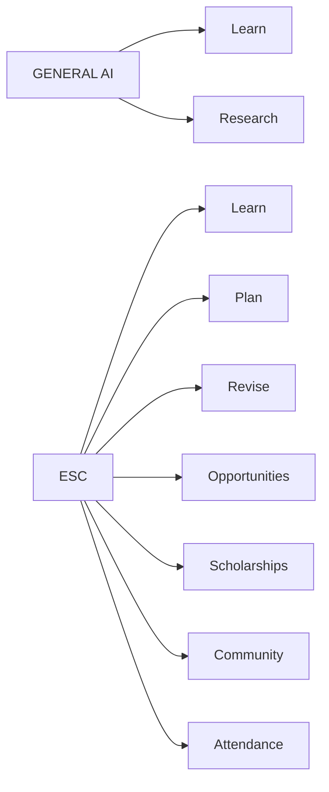

| Layer | ESC |
|---|:---:|
| Learn | ✓ |
| Research | ✓ |
| Plan | ✓ |
| Revise | ✓ |
| Opportunities | ✓ |
| Scholarships | ✓ |
| Community | ✓ |
| Attendance | ✓ |

---

# 08 · 100-TASK BENCHMARK

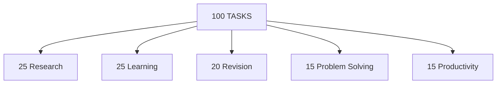

### Task mix

---

# 09 · TEST PIPELINE

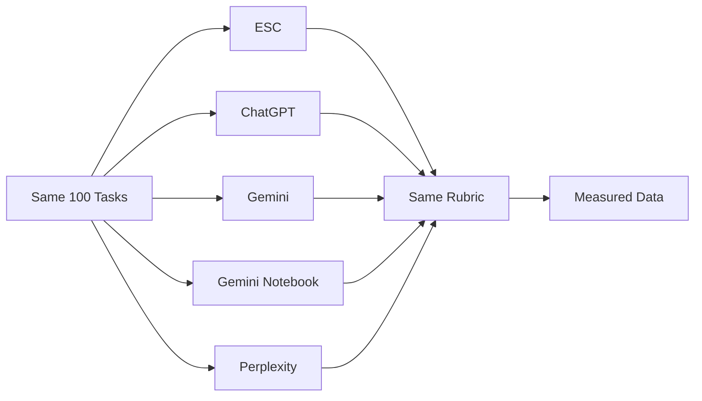

| Control | Same? |
|---|:---:|
| Prompt | ✓ |
| Source | ✓ |
| Task | ✓ |
| Rubric | ✓ |
| Model tier | ✓ where possible |
| Date | Record |
| Latency | Record |

---

# 10 · SCORING MODEL

| Metric | Weight |
|---|---:|
| Accuracy | **40%** |
| Completion | **30%** |
| Sources | **20%** |
| Instructions | **10%** |
| **TOTAL** | **100%** |

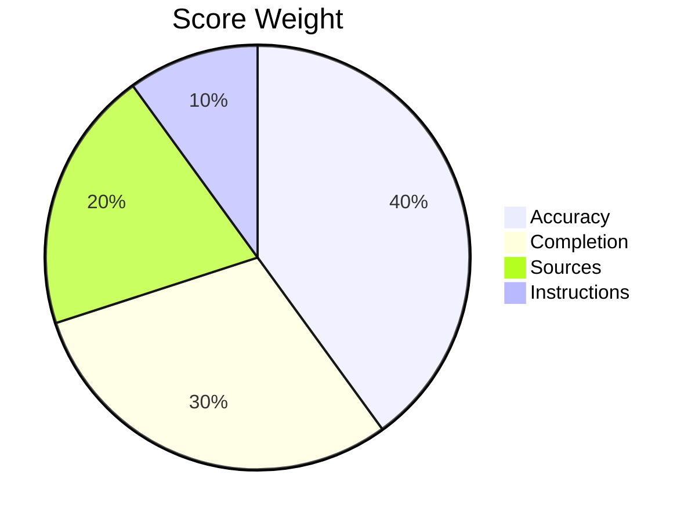

---

# 11 · BENCHMARK DATA TABLE

| Tool | Overall | Accuracy | Completion | Sources | Latency |
|---|---:|---:|---:|---:|---:|
| **ESC** | — | — | — | — | — |
| ChatGPT | — | — | — | — | — |
| Gemini | — | — | — | — | — |
| Gemini Notebook | — | — | — | — | — |
| Perplexity | — | — | — | — | — |

> `— = test pending`

---

# 12 · CATEGORY DATA

| Tool | Research | Learning | Revision | Problems | Productivity |
|---|---:|---:|---:|---:|---:|
| ESC | — | — | — | — | — |
| ChatGPT | — | — | — | — | — |
| Gemini | — | — | — | — | — |
| Notebook | — | — | — | — | — |
| Perplexity | — | — | — | — | — |

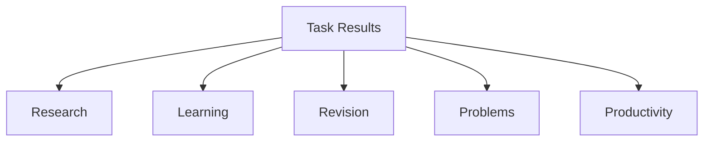

---

# 13 · ANALYTICS DASHBOARD

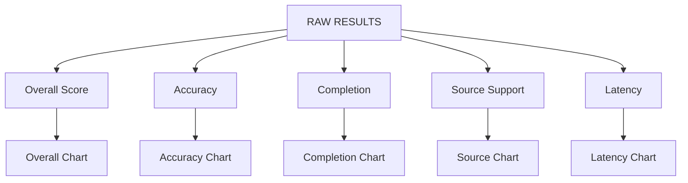

### Chart set

| Chart | Data |
|---|---|
| Overall | Score / 100 |
| Category | 5 task groups |
| Accuracy | % |
| Completion | % |
| Sources | % |
| Latency | Seconds |

---

# 14 · CHART-READY RESULT GRID

| Tool | Score | Accuracy | Completion | Sources | Latency |
|---|---:|---:|---:|---:|---:|
| ESC | TBD | TBD | TBD | TBD | TBD |
| ChatGPT | TBD | TBD | TBD | TBD | TBD |
| Gemini | TBD | TBD | TBD | TBD | TBD |
| Notebook | TBD | TBD | TBD | TBD | TBD |
| Perplexity | TBD | TBD | TBD | TBD | TBD |

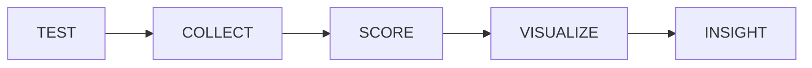

---

# 15 · ACCESS

| Tool | Free | Paid |
|---|:---:|:---:|
| ESC | ✓ | — |
| ChatGPT | ✓ | ✓ |
| Gemini | ✓ | ✓ |
| Gemini Notebook | ✓ | ✓ |
| Perplexity | ✓ | ✓ |

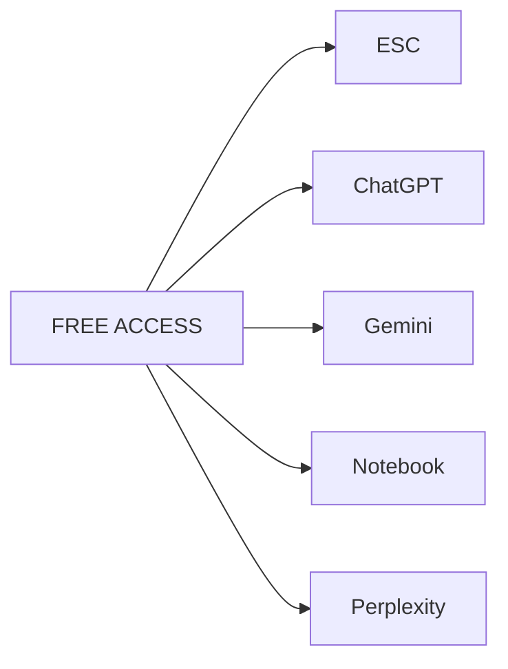

---

# 16 · DATA SOURCES

| Source | Used for |
|---|---|
| OpenAI Study Mode | Learning / files / practice |
| OpenAI Deep Research | Research |
| Google Gemini Help | Research / files |
| Google | Gemini Notebook |
| Perplexity Help | Search / citations / files |
| Google One | Plan / access |
| Anthropic | Claude ecosystem |

---

# 17 · HACKATHON STORY

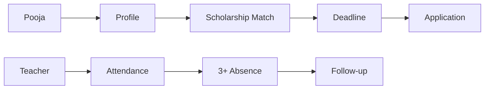

---

# 18 · FINAL DATA FLOW

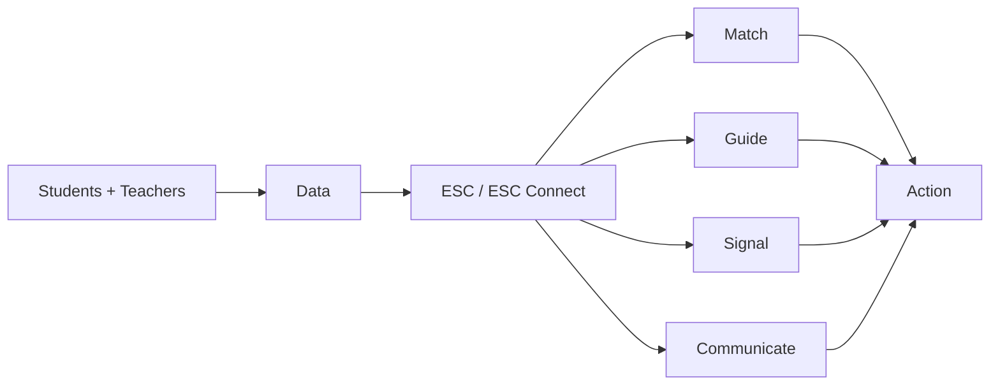

## STATUS

| Layer | Status |
|---|---|
| Product analytics | ✓ |
| Capability data | ✓ |
| Benchmark design | ✓ |
| Benchmark results | **Pending** |
| Result charts | **Fill after testing** |

**Rule:** no fabricated benchmark numbers.
