# ESC — Data Analytics

## 01 · GAP

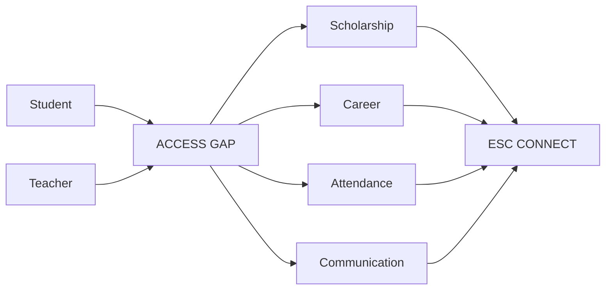

| Problem | Module |
|---|---|
| Scholarships | Finder |
| Jobs / ITI | Opportunities |
| Absence | Follow-up |
| Communication | Community |

---

## 02 · ESC CONNECT

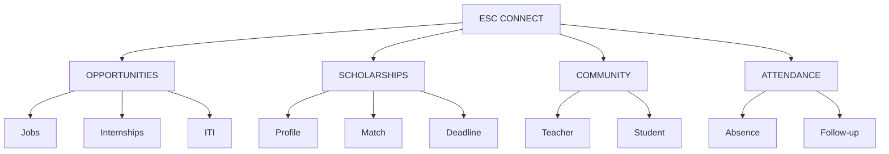

## 03 · STUDENT FLOW

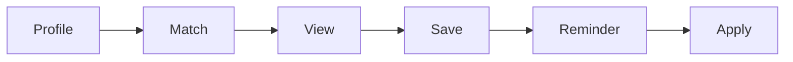

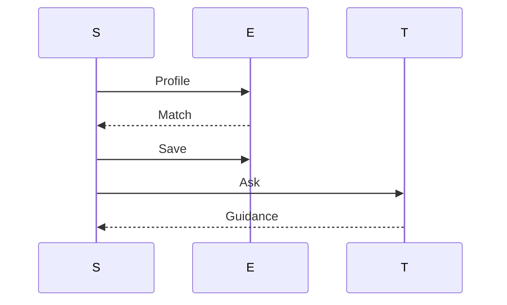

---

## 04 · ATTENDANCE

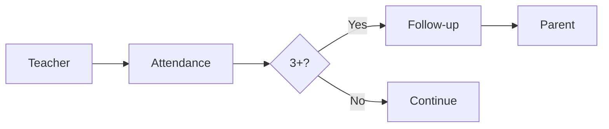

---

## 05 · CAPABILITY MATRIX

| Capability | ChatGPT | Gemini | Notebook | Perplexity | **ESC** |
|---|:---:|:---:|:---:|:---:|:---:|
| Chat | ✓ | ✓ | ✓ | ✓ | ✓ |
| Files | ✓ | ✓ | ✓ | ✓ | ✓ |
| Learning | ✓ | ✓ | ✓ | △ | ✓ |
| Research | ✓ | ✓ | ✓ | ✓ | ✓ |
| Citations | ✓ | ✓ | ✓ | ✓ | ✓ |
| Quiz | ✓ | ✓ | ✓ | △ | ✓ |
| Revision | ✓ | ✓ | ✓ | △ | ✓ |
| Planning | ✓ | ✓ | △ | △ | ✓ |
| **12 agents** | — | — | — | — | **✓** |
| Scholarships | — | — | — | — | **✓** |
| Jobs / ITI | — | — | — | — | **✓** |
| Teacher chat | — | — | — | — | **✓** |
| Attendance | — | — | — | — | **✓** |
| Low-data focus | — | — | — | — | **✓** |

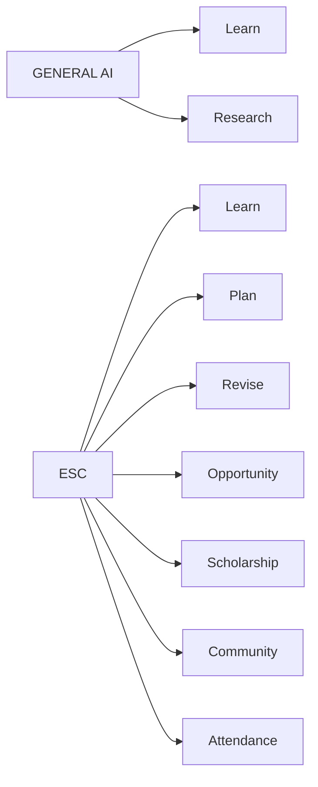

---

## 06 · 12 AGENTS

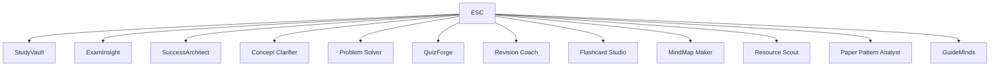

---

## 07 · BENCHMARK

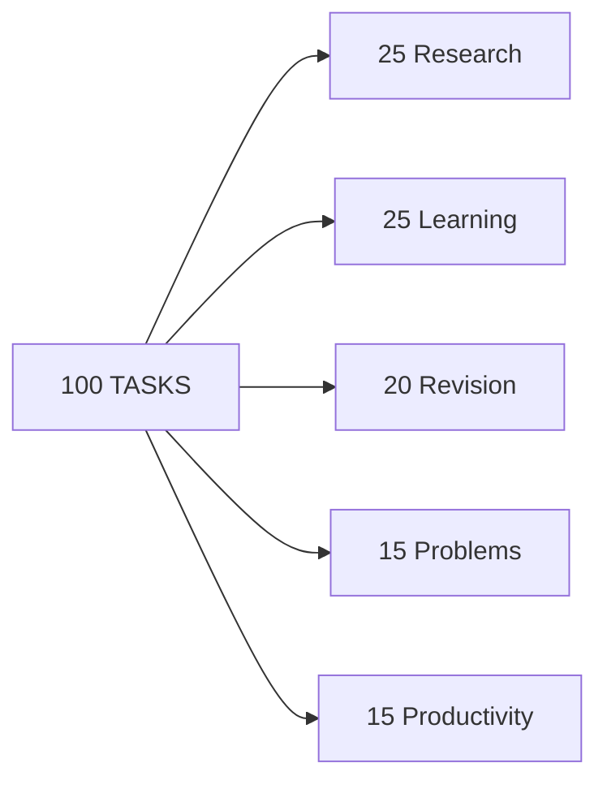

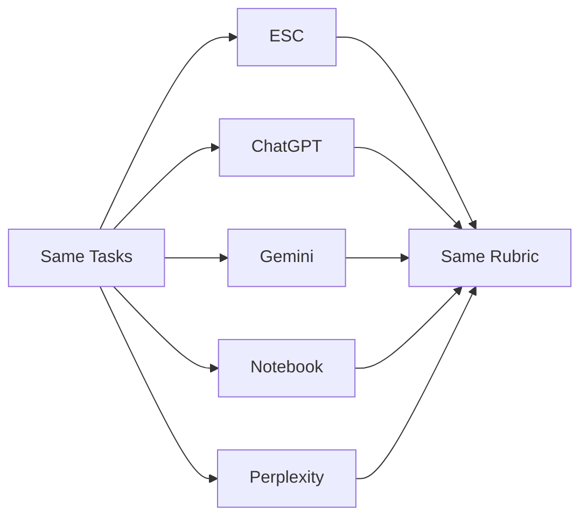

| Metric | Weight |
|---|---:|
| Accuracy | 40% |
| Completion | 30% |
| Sources | 20% |
| Instructions | 10% |

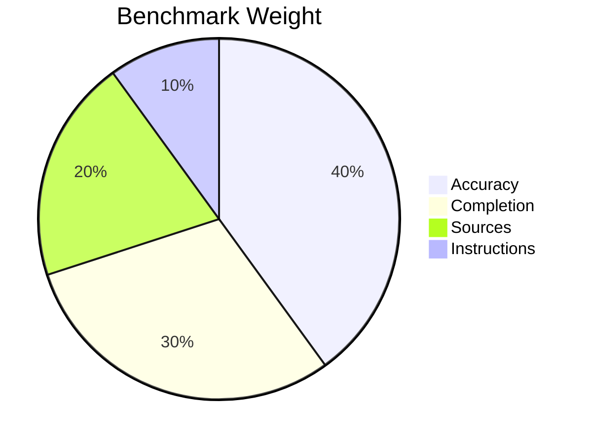

---

## 08 · RESULTS

| Tool | Score | Accuracy | Completion | Sources | Latency |
|---|---:|---:|---:|---:|---:|
| ESC | — | — | — | — | — |
| ChatGPT | — | — | — | — | — |
| Gemini | — | — | — | — | — |
| Notebook | — | — | — | — | — |
| Perplexity | — | — | — | — | — |

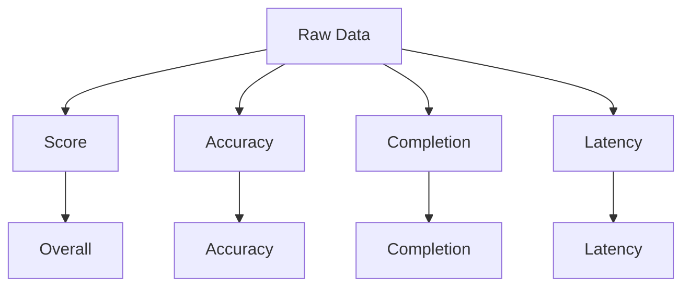

---

## 09 · ACCESS

| Tool | Free | Paid |
|---|:---:|:---:|
| ESC | ✓ | — |
| ChatGPT | ✓ | ✓ |
| Gemini | ✓ | ✓ |
| Notebook | ✓ | ✓ |
| Perplexity | ✓ | ✓ |

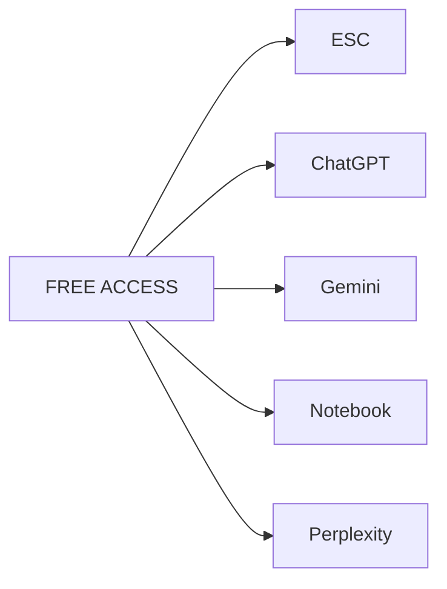

---

## 10 · DATA SOURCES

| Source | Data |
|---|---|
| OpenAI | Study Mode + Deep Research |
| Google | Gemini + Notebook |
| Perplexity | Search + citations |
| Anthropic | Claude |

---

### STATUS

`Data ✓` · `Benchmark —`
