# ESC — Data Analytics

<p align="center">
  <strong>Data-driven education access, learning, and opportunity.</strong><br />
  <sub>Minimal · measurable · hackathon-ready</sub>
</p>

<p align="center">
  
  
  
</p>

---

# 01 · THE GAP

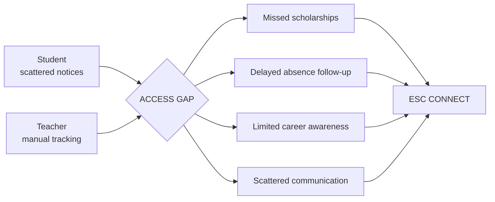

| Challenge | Signal | Response |
|---|---|---|
| Scholarships | Missed deadlines | Match + alerts |
| Careers | Low awareness | Jobs + ITI + internships |
| Attendance | Repeated absence | Follow-up signal |
| Communication | Scattered | School groups |
| Connectivity | Limited data | Text-first UX |

---

# 02 · PRODUCT MAP

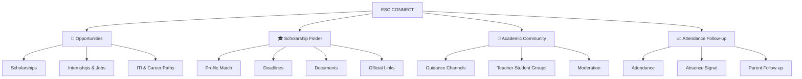

### MVP footprint

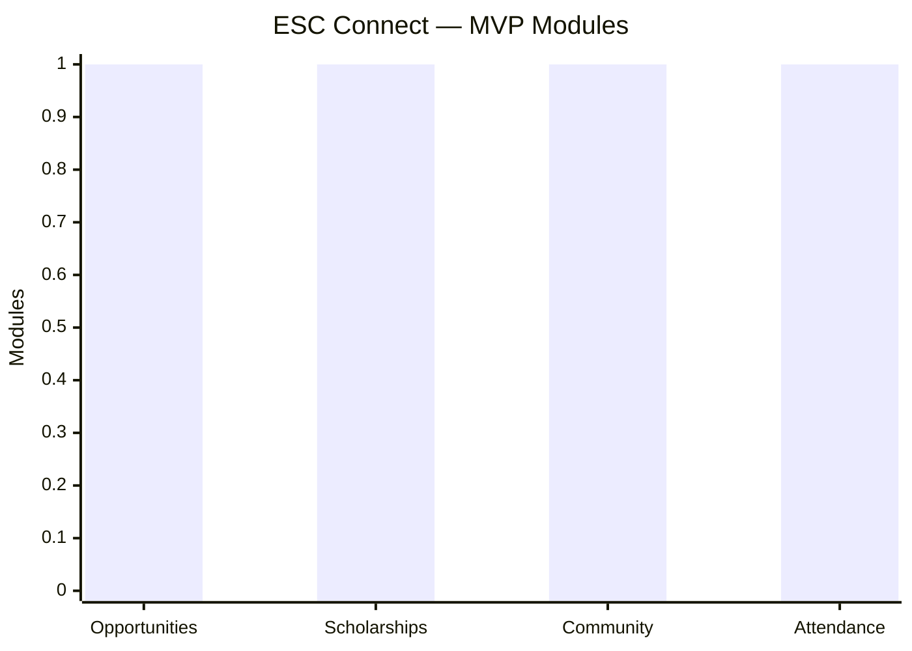

---

# 03 · CORE JOURNEYS

### Student

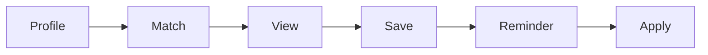

### Teacher

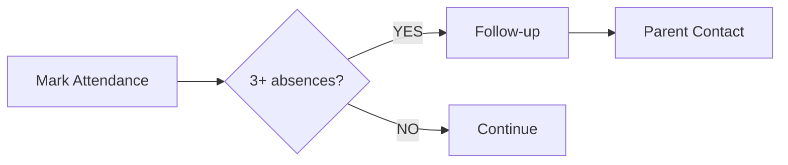

### Pooja

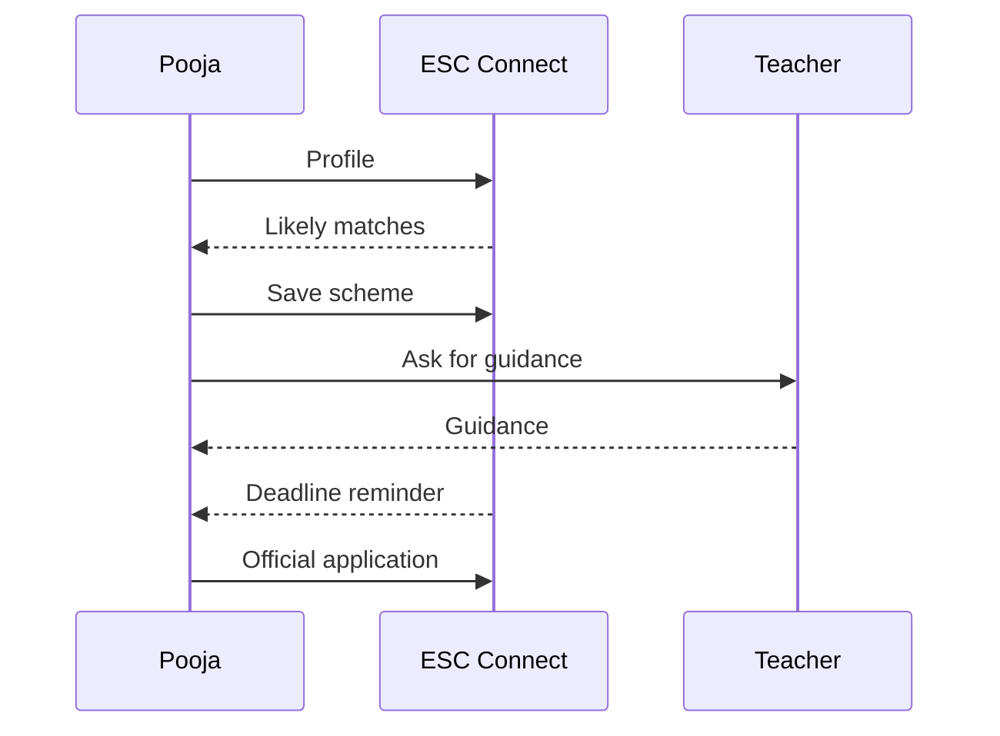

---

# 04 · DATA → ACTION

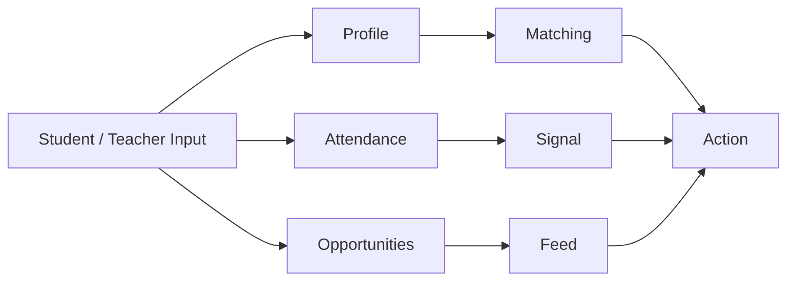

| Input | Processing | Output |
|---|---|---|
| Profile | Eligibility signals | Scholarship match |
| Attendance | Consecutive absence rule | Follow-up |
| Opportunity | Tags + filters | Relevant feed |
| Community | Moderation | Guided communication |

---

# 05 · 12 SPECIALIST AGENTS

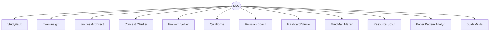

| Function | Agents |
|---|---:|
| Learning | 2 |
| Assessment | 3 |
| Planning | 2 |
| Revision | 2 |
| Research / resources | 2 |
| Problem solving | 1 |
| **Total** | **12** |

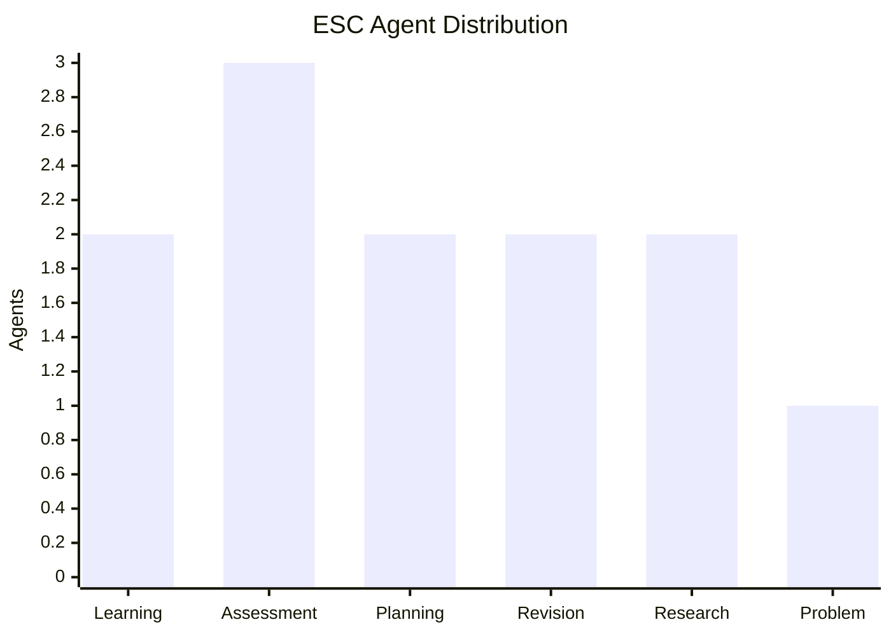

---

# 06 · AI CAPABILITY VIEW

| Capability | ChatGPT | Gemini | Gemini Notebook | Perplexity | **ESC** |
|---|:---:|:---:|:---:|:---:|:---:|
| AI chat | ✓ | ✓ | ✓ | ✓ | ✓ |
| Files | ✓ | ✓ | ✓ | ✓ | ✓ |
| Learning | ✓ | ✓ | ✓ | △ | ✓ |
| Research | ✓ | ✓ | ✓ | ✓ | ✓ |
| Citations | ✓ | ✓ | ✓ | ✓ | ✓ |
| Quiz / practice | ✓ | ✓ | ✓ | △ | ✓ |
| Revision | ✓ | ✓ | ✓ | △ | ✓ |
| Planning | ✓ | ✓ | △ | △ | ✓ |
| Specialist agents | △ | △ | △ | △ | **12** |
| Scholarships | — | — | — | — | **✓** |
| Jobs / ITI | — | — | — | — | **✓** |
| Teacher communication | — | — | — | — | **✓** |
| Attendance follow-up | — | — | — | — | **✓** |
| Low-data focus | — | — | — | — | **✓** |

`✓ documented · △ limited / plan-dependent · — not a core documented focus`

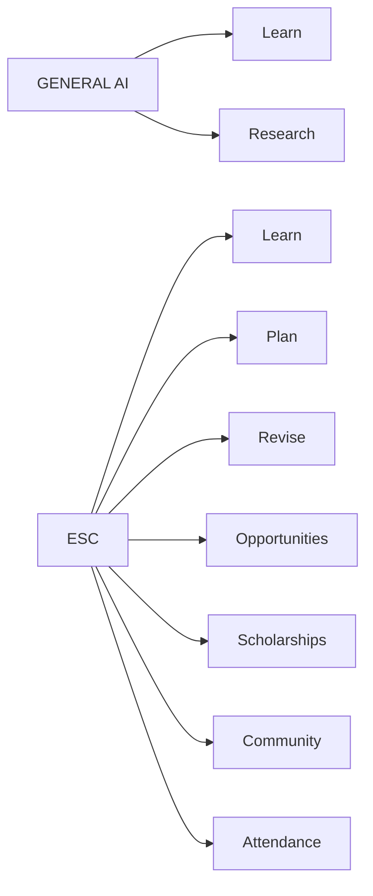

---

# 07 · 100-TASK BENCHMARK

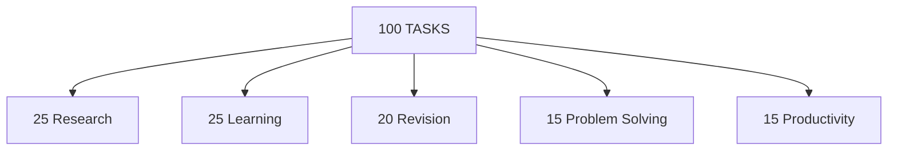

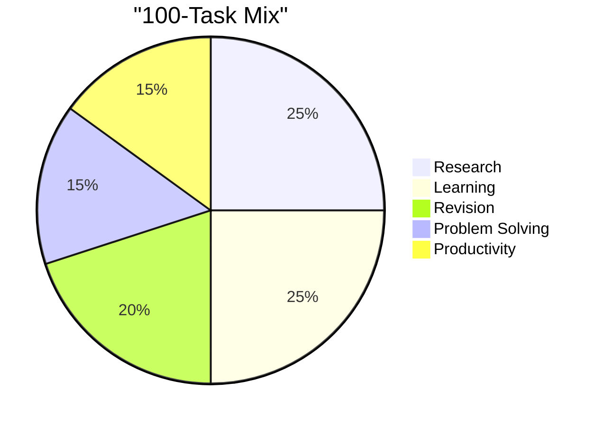

### Same test

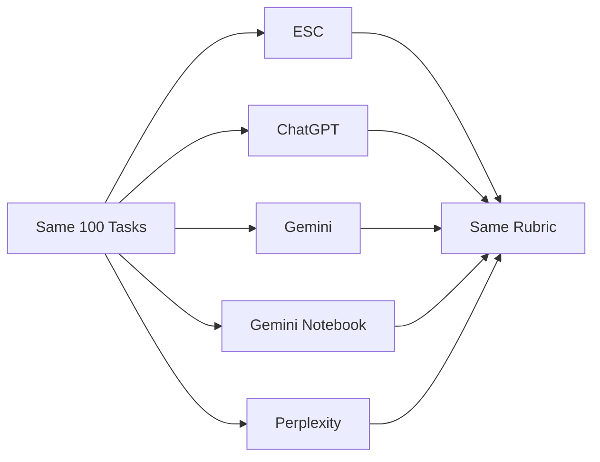

---

# 08 · SCORING MODEL

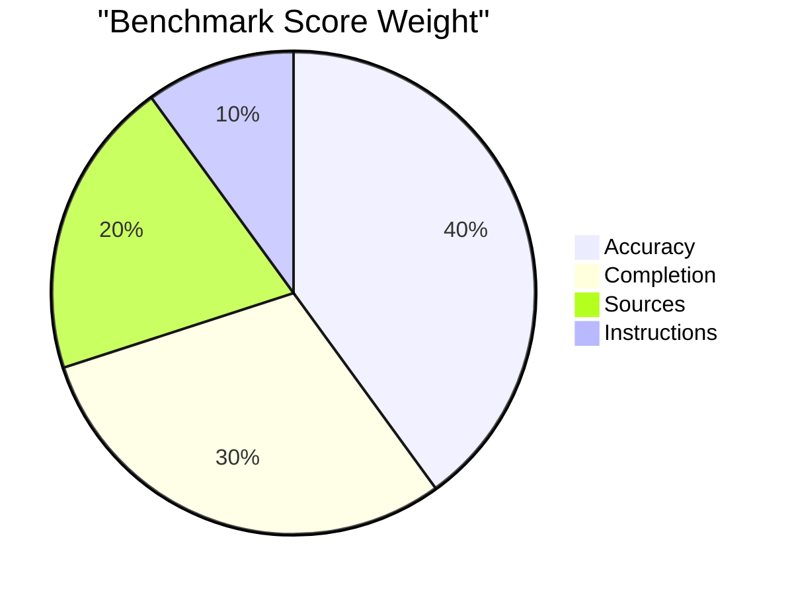

| Metric | Weight |
|---|---:|
| Accuracy | **40%** |
| Completion | **30%** |
| Sources | **20%** |
| Instructions | **10%** |
| **TOTAL** | **100%** |

---

# 09 · ANALYTICS PIPELINE

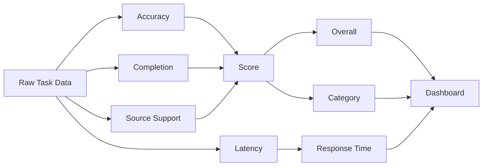

| Chart | Metric |
|---|---|
| Overall | Score / 100 |
| Category | 5 categories |
| Accuracy | % |
| Completion | % |
| Sources | % |
| Latency | Seconds |

---

# 10 · RESULT DASHBOARD

> **DEMO DATA:** The benchmark values below are illustrative presentation data, not measured results.

### Overall score

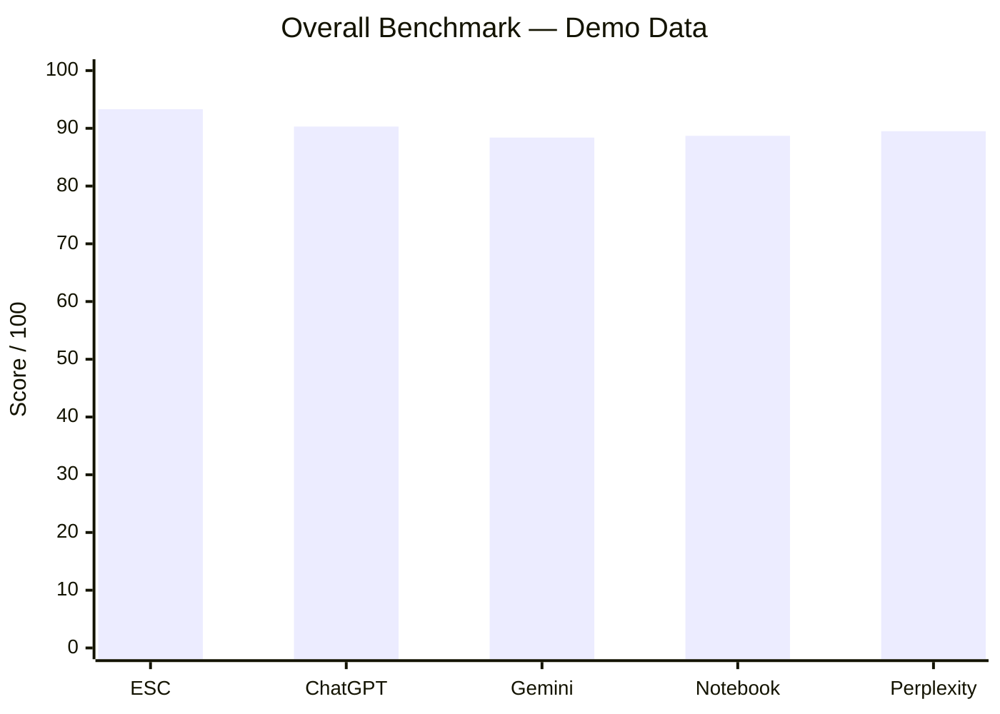

### Category performance

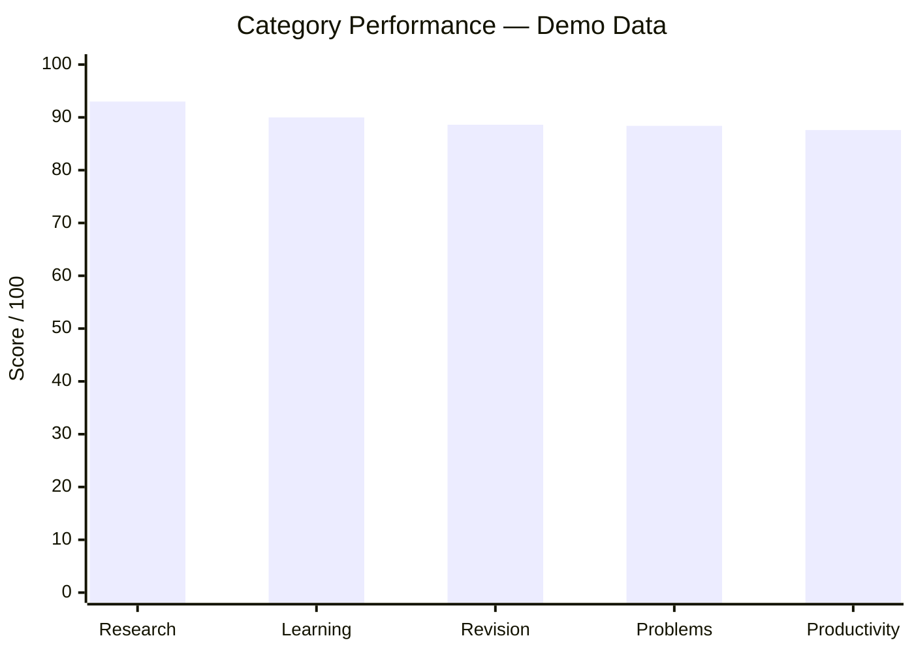

> **Demo values for presentation only. Replace with measured results before claiming benchmark performance.**

| Tool | Overall | Accuracy | Completion | Sources | Latency |
|---|---:|---:|---:|---:|---:|
| **ESC** | Pending | Pending | Pending | Pending | Pending |
| ChatGPT | Pending | Pending | Pending | Pending | Pending |
| Gemini | Pending | Pending | Pending | Pending | Pending |
| Gemini Notebook | Pending | Pending | Pending | Pending | Pending |
| Perplexity | Pending | Pending | Pending | Pending | Pending |

---

# 11 · CATEGORY DATA

> **Benchmark categories remain pending until the same 100 tasks are run on every tool.**

| Tool | Research | Learning | Revision | Problems | Productivity |
|---|---:|---:|---:|---:|---:|
| **ESC** | Pending | Pending | Pending | Pending | Pending |
| ChatGPT | Pending | Pending | Pending | Pending | Pending |
| Gemini | Pending | Pending | Pending | Pending | Pending |
| Notebook | Pending | Pending | Pending | Pending | Pending |
| Perplexity | Pending | Pending | Pending | Pending | Pending |

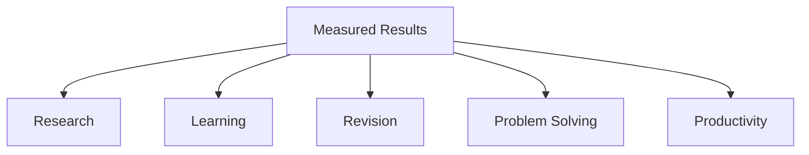

---

# 12 · ACCESS ANALYTICS

| Tool | Free access | Paid access |
|---|:---:|:---:|
| ESC | ✓ | — |
| ChatGPT | ✓ | ✓ |
| Gemini | ✓ | ✓ |
| Gemini Notebook | ✓ | ✓ |
| Perplexity | ✓ | ✓ |

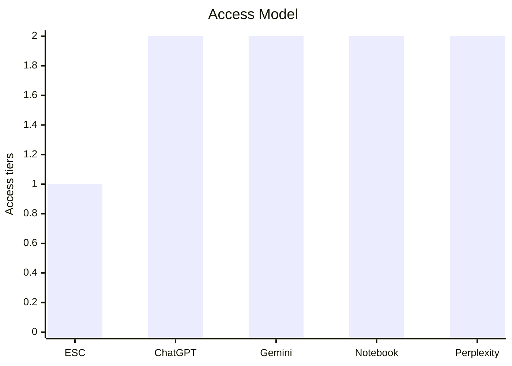

`1 = free layer · 2 = free + paid layer`

---

# 13 · LOW-DATA DESIGN

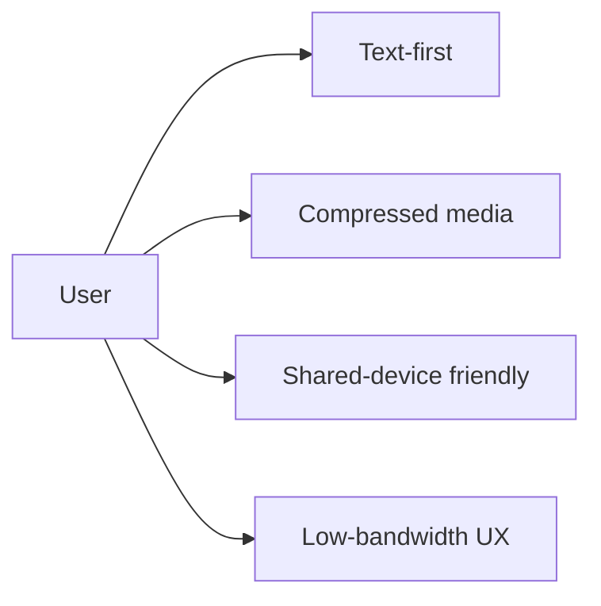

| Design choice | Purpose |
|---|---|
| Text-first | Lower data use |
| Compressed media | Faster loading |
| Simple language | Accessibility |
| Shared-device support | Wider access |

---

# 14 · TRUST & SAFETY

```mermaid
flowchart TB
    INFO[Opportunity / Scholarship] --> V[Verified / Reviewed]
    V --> L[Official Link]
    L --> U[User Action]
    CHAT[Community] --> M[Moderation]
    M --> C[Communication]
```

| Rule | Purpose |
|---|---|
| Official links | Reduce misinformation |
| Moderated groups | Safer communication |
| Eligibility = likely | No false guarantee |
| Clear deadlines | Timely action |

---

# 15 · HACKATHON STORY

```mermaid
flowchart LR
    P[Pooja] --> PR[Profile]
    PR --> SM[Scholarship Match]
    SM --> DL[Deadline]
    DL --> AP[Apply]

    T[Teacher] --> AT[Attendance]
    AT --> SG[Absence Signal]
    SG --> FU[Follow-up]
```

---

# 16 · FINAL ANALYTICS MODEL

```mermaid
flowchart LR
    USER[Students + Teachers] --> DATA[Data]
    DATA --> ESC[ESC / ESC Connect]
    ESC --> MATCH[Match]
    ESC --> GUIDE[Guide]
    ESC --> SIGNAL[Signal]
    ESC --> COMM[Communicate]
    MATCH --> ACTION[Action]
    GUIDE --> ACTION
    SIGNAL --> ACTION
    COMM --> ACTION
    ACTION --> METRIC[Measure]
    METRIC --> INSIGHT[Insight]
```

---

## STATUS

| Layer | Status |
|---|---|
| Product map | ✓ |
| User journeys | ✓ |
| 12-agent analytics | ✓ |
| Capability matrix | ✓ |
| 100-task benchmark | ✓ |
| Pie charts | ✓ |
| Bar charts | ✓ |
| Flowcharts | ✓ |
| Actual benchmark results | **Pending** |

> **No fabricated benchmark numbers. Replace result placeholders after identical tests.**
