# ESC — Data Analytics

## 1. GAP

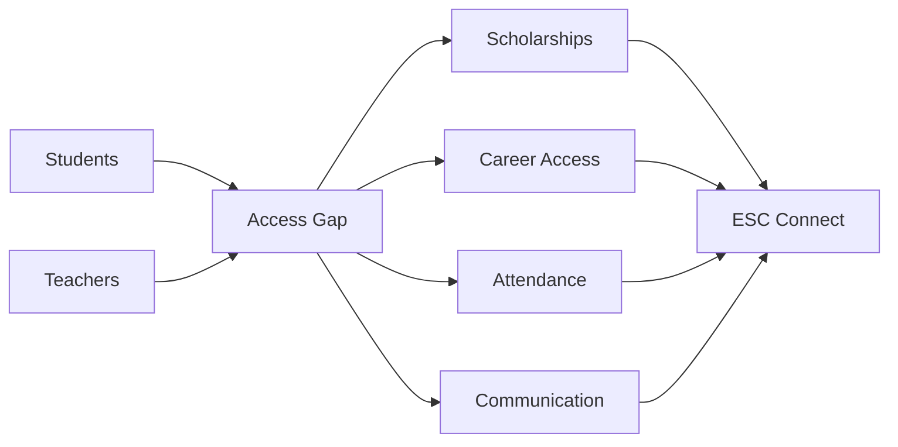

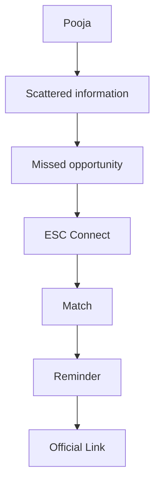

| Gap | ESC Connect |
|---|---|
| Scholarships | Match + deadline |
| Careers | Jobs + ITI + internships |
| Attendance | Absence signal |
| Communication | Groups + guidance |

---

## 2. PRODUCT MAP

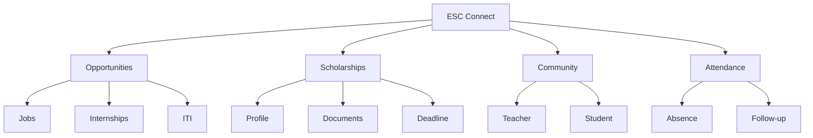

---

## 3. USER FLOW

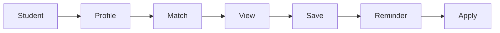

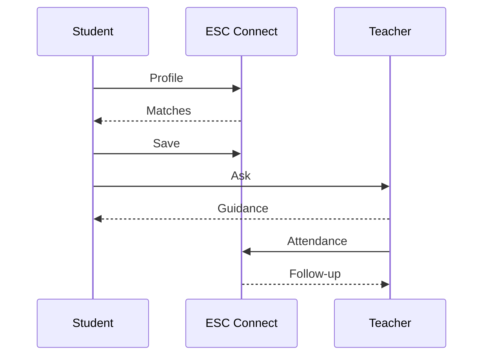

---

## 4. ATTENDANCE

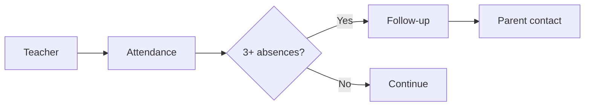

---

## 5. ESC vs AI TOOLS

| Capability | ChatGPT | Gemini | Gemini Notebook | Perplexity | ESC |
|---|:---:|:---:|:---:|:---:|:---:|
| AI chat | ✓ | ✓ | ✓ | ✓ | ✓ |
| Files | ✓ | ✓ | ✓ | ✓ | ✓ |
| Learning | ✓ | ✓ | ✓ | △ | ✓ |
| Research | ✓ | ✓ | ✓ | ✓ | ✓ |
| Citations | ✓ | ✓ | ✓ | ✓ | ✓ |
| Quiz / revision | ✓ | ✓ | ✓ | △ | ✓ |
| Study planning | ✓ | ✓ | △ | △ | ✓ |
| Specialist agents | △ | △ | △ | △ | **12** |
| Scholarships | — | — | — | — | **✓** |
| Internships / jobs | — | — | — | — | **✓** |
| Teacher communication | — | — | — | — | **✓** |
| Attendance follow-up | — | — | — | — | **✓** |
| Low-data focus | — | — | — | — | **✓** |

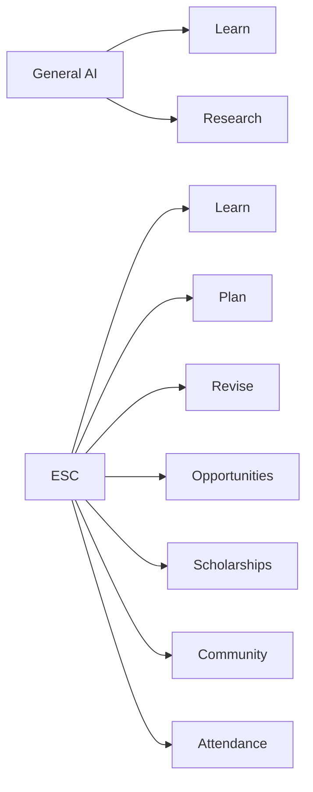

---

## 6. 100-TASK BENCHMARK

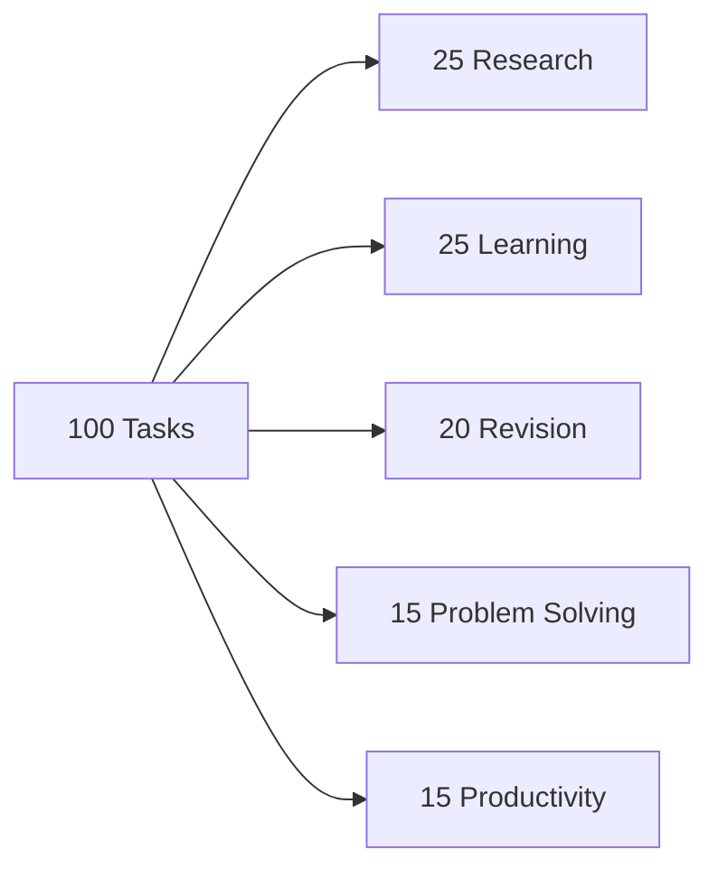

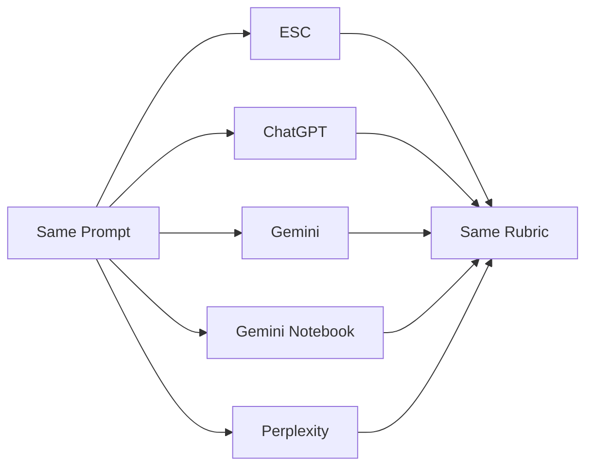

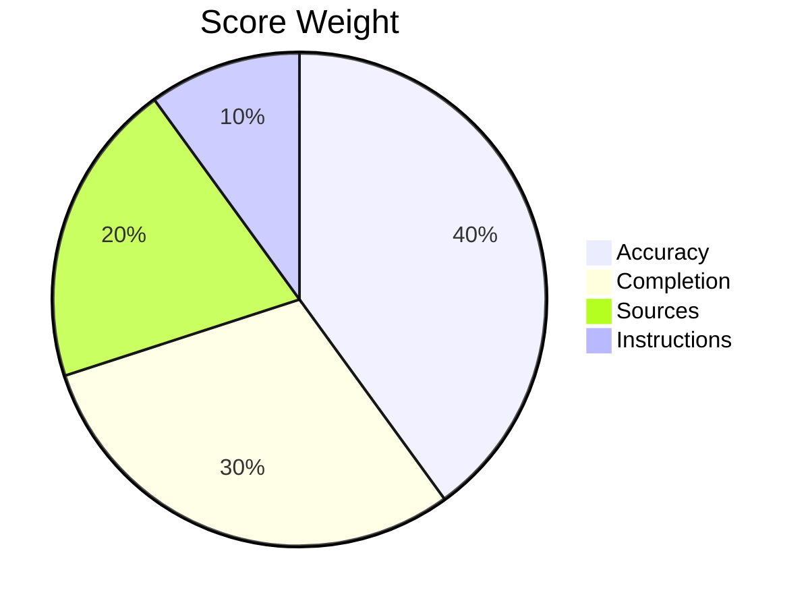

| Tool | Score | Accuracy | Completion | Sources | Latency |
|---|---:|---:|---:|---:|---:|
| ESC | — | — | — | — | — |
| ChatGPT | — | — | — | — | — |
| Gemini | — | — | — | — | — |
| Gemini Notebook | — | — | — | — | — |
| Perplexity | — | — | — | — | — |

---

## 7. ANALYTICS

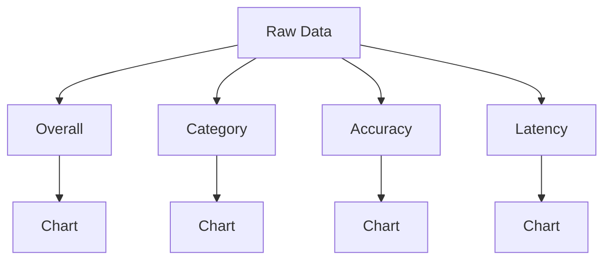

---

## 8. ACCESS

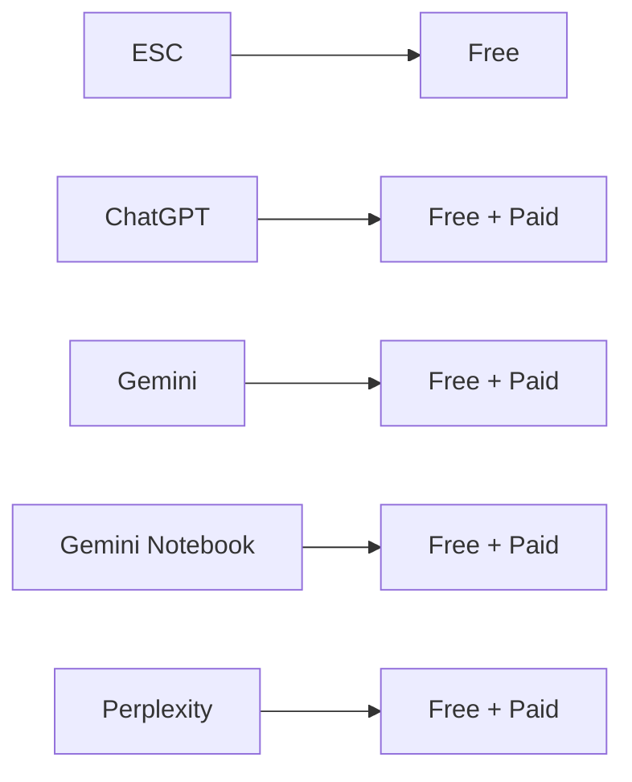

---

## 9. SOURCES

- OpenAI Study Mode
- OpenAI Deep Research
- Google Gemini Help
- Google — Gemini Notebook
- Perplexity Help
- Google One
- Anthropic

## STATUS

`Capability data ✓` · `Benchmark results —`
